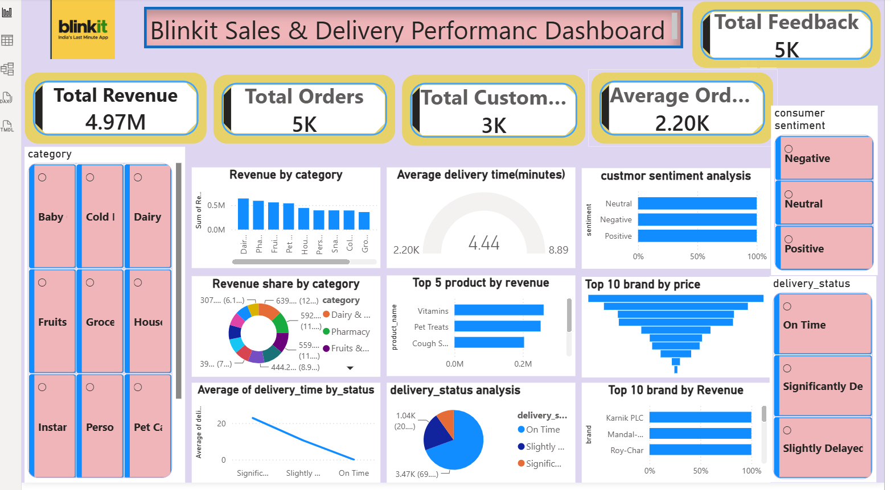

# Blinkit Sales & Delivery Performance Dashboard

## 📌 Project Overview
This project is an interactive Power BI dashboard built to analyze Blinkit sales, delivery performance, customer feedback, and product performance.

## 📊 Dashboard Preview

> Upload your final dashboard screenshot and add it here after renaming it to `Dashboard-Screenshot.png`.

## 🚀 Key KPIs
- Total Revenue
- Total Orders
- Total Customers
- Average Order Value
- Total Feedback

## 📈 Dashboard Features
- Revenue by Category
- Revenue Share by Category
- Average Delivery Time Analysis
- Customer Sentiment Analysis
- Top 5 Products by Revenue
- Top 10 Brands by Revenue
- Top 10 Brands by Price
- Interactive Slicers (Category, Sentiment, Delivery Status)

## 🛠️ Tools Used
- Power BI
- Power Query
- DAX
- Excel

## 💡 Business Insights
- Generated 4.97M total revenue.
- Processed 5K customer orders.
- Analyzed customer sentiment using feedback data.
- Identified top-performing products and brands.
- Monitored delivery performance across different delivery statuses.
## 📊 Dashboard Preview

